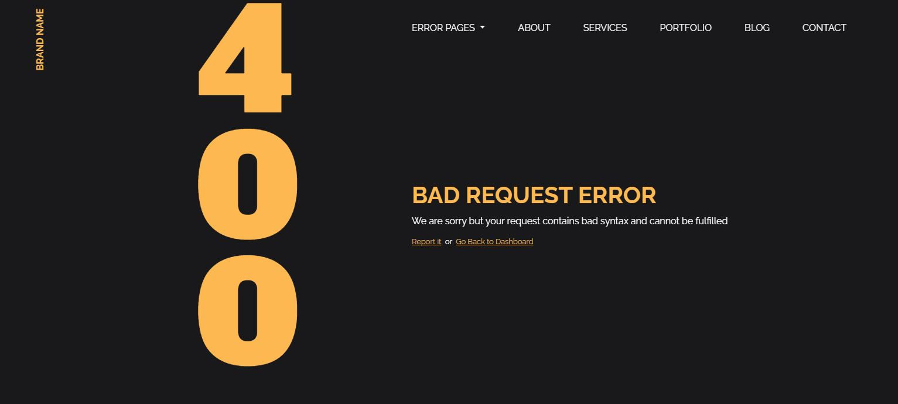
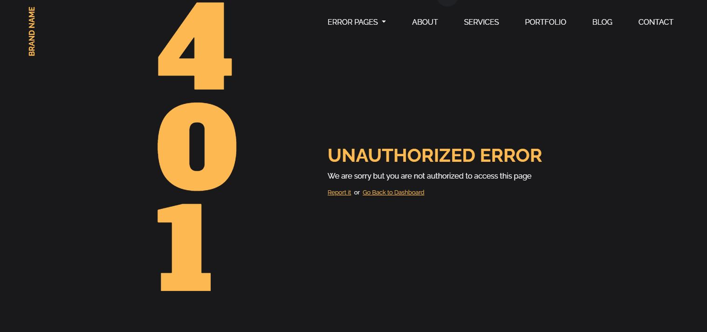
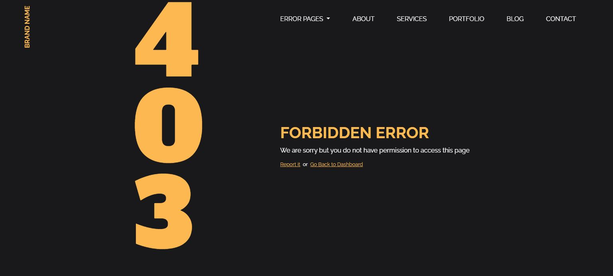

<h1>Error web templates using Sass Bootstrap 4</h1>

Create error pages (404,401,403,404,500,503) Website Templates usign Sass Bootstrap 4

- 🔭 I’m currently working on ...
- 🌱 I’m currently learning ...
- 👯 I’m looking to collaborate on ...
- 🤔 I’m looking for help with ...
- 💬 Ask me about ...
- 📫 How to reach me: ...
- 😄 Pronouns: ...
- ⚡ Fun fact: ...

<table>
  <thead>
    <th>sdasd</th>
    <th>asd</th>
    <th>asd</th>
  </thead>
    <tbody>
        <tr>asd</tr>
        <tr>asd</tr>
        <tr>asd</tr>
    </tbody>
</table>

<table>
  <tbody>
    <tr></tr>
    <tr></tr>
    <tr></tr>
  </tbody>
</table>
