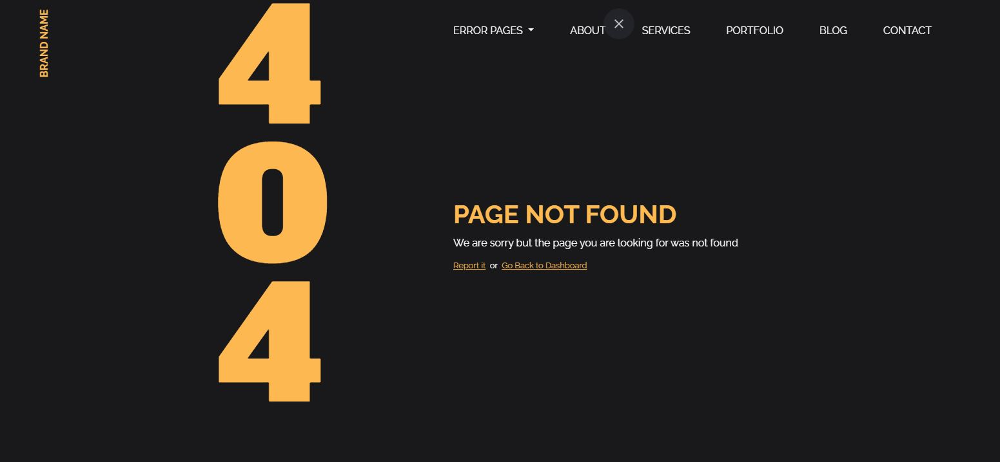
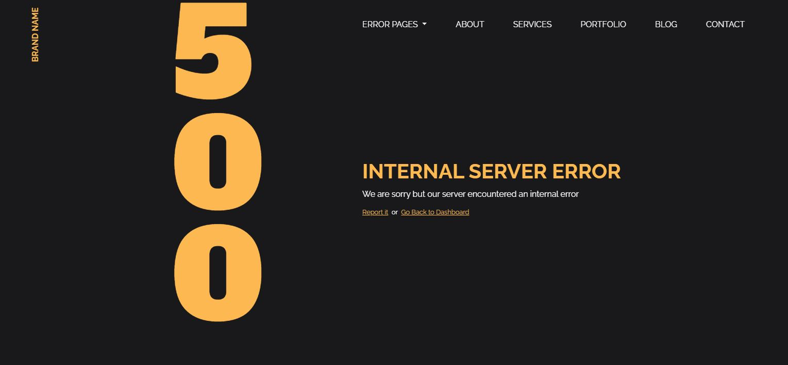
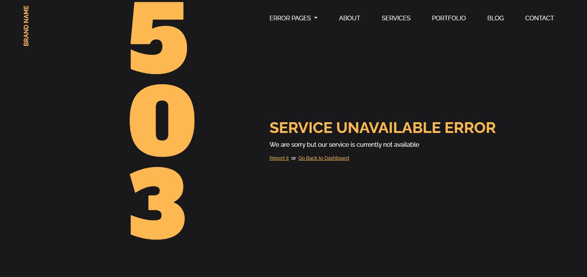

# Error web templates using Sass Bootstrap 4

Create error pages (404,401,403,404,500,503) Website Templates usign Sass
Bootstrap 4
 
 

### Support or Contact

Having trouble with Pages? Please [send a request](https://varunharikumar.com/lets-talk.php) or contact my email address : hello@varunharikumar.com and I’ll help you sort it out.

 
 

assets/ 
| 
|– fontawesome 
|– animate.css 
|– bootstrap 
|– jquery 
| 
css/ 
| 
|– plugin.css 
| 
sass/ 
| 
|– main.css 
|– main.scss 
|– main.css.map 
|– main.min.css 
| 
error-401.html 
error-403.html 
error-404.html 
error-500.html 
error-503.html 
index.html 

 
 

<table>
  <tbody>
    <tr>
      <td>
        
      </td>
      <td>
        
      </td>     
    </tr>
    <tr>
      <td>
        
      </td>
      <td>
        
      </td>      
    </tr>
    <tr>
      <td>
        
      </td>
      <td>
        
      </td>     
    </tr>
  </tbody>
</table>

